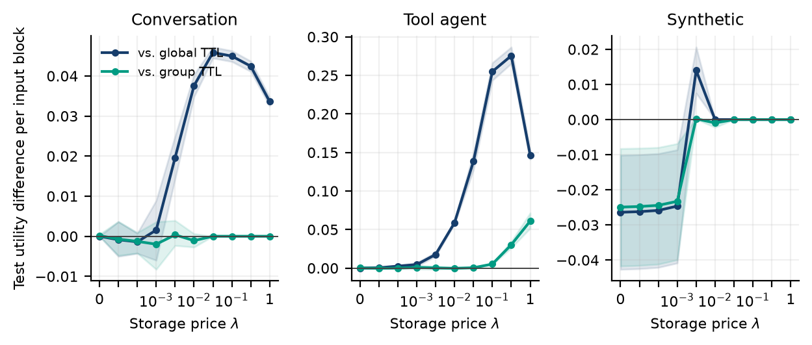

# Prefix-Certificate Retention (PCR)

Research artifact for **Exact Memory-Time Optimization for Prefix-Cached Language
Model Serving**, by **Shivam Gupta**, Independent Researcher.

PCR optimizes static, grouped reset-on-access timeouts against a finite request
trace. Its objective is **usable contiguous prefix blocks minus a storage price
times occupied block-seconds**. A dependency graph makes this a maximum-weight
closure problem, solved by one minimum cut. Using all observed reuse ages also
solves the continuous nonnegative-timeout problem under the stated model.

[Read the paper](output/pdf/prefix-certificate-retention.pdf) ·
[Poster](output/pdf/prefix-certificate-retention-poster.pdf) ·
[Literature and novelty scope](notes/literature_review.md) ·
[Experiment protocol](notes/protocol.md)



## What the artifact establishes

- An exact mathematical formulation, a coherent-policy dynamic program, bounds,
  and expected-memory-time mixture certificates.
- 11 tests, including exhaustive profile enumeration, a separate NetworkX cut
  encoding, independent event replay, and 450 full-policy linear-program checks.
- Chronological experiments on 39,632 requests from three pinned public Mooncake
  traces, including 35,639 production-derived requests.
- Every declared price and unfavorable result is retained. On the fixed grid,
  coherent policies match the unrestricted training optimum in 118/120 cases.
- The finer event-age optimizer improves the historical objective but does not
  consistently improve transfer. The exact solver is primarily a benchmark and
  certification tool, not evidence that more complex retention is always better.

This is **cache trace replay**, not a GPU-serving benchmark. It assumes immediate
post-batch availability, full-block writes, an independently addressed store,
and a serving interface that reuses contiguous prefixes. It does not measure
latency, energy, dollars, model quality, or enforce hard memory capacity.

## Reproduce

Python 3.12 is recommended. Tectonic is needed only to typeset the manuscript.
No model API, API key, paid compute, or plaintext prompts are required.

```bash
python3.12 -m venv .venv
source .venv/bin/activate
python -m pip install -r requirements.lock
python -m pip install --no-deps -e .
make test
make data
make experiments
make figures
make paper
make poster
make arxiv
```

For an unconstrained fresh dependency installation, use
`python -m pip install -e '.[test,artifacts]'` instead of the lock file. The
committed lock records the versions used for the reported results. Solver timing
varies by machine. The numerical replay endpoints are deterministic on these
inputs; the bootstrap uses seed 20260923.

`make experiments` runs the initial protocol, fixed-grid closure comparisons and
one-second timestamp sensitivity, then the exploratory event-age comparison.
It rewrites result files. The complete study takes a few minutes on the development
machine; no GPU is needed. Data downloads total approximately 8.6 MB and are
validated against pinned SHA-256 digests before use.

## Minimal working example

```python
import numpy as np
from prefix_retention.trace import Request, Grouping, tables
from prefix_retention.closure import build_certificates, solve_closure
from prefix_retention.optimize import price_solution

requests = ([Request(0, (1, 2))]
            + [Request(float(t), (1,)) for t in range(1, 10)]
            + [Request(10, (1, 2))])
groups = Grouping(requests, 'group', top_k=0)
grid = np.array([0., 1., 10.])
hits, cost = tables(requests, 20., groups, grid)
certificates = build_certificates(requests, groups, grid)
exact, diagnostics = solve_closure(certificates, cost, price=.04)
coherent = price_solution(hits, cost, groups.parents, price=.04)
print(grid[exact.labels], exact.value, coherent.value)
# [1. 10.] 9.76 9.56
```

For exact optimization over all nonnegative timeouts:

```python
from prefix_retention.event_grid import event_tables
grids, cost = event_tables(requests, 20., groups)
certificates = build_certificates(requests, groups, grids)
solution, diagnostics = solve_closure(certificates, cost, price=.04)
timeouts = [grid[k] for grid, k in zip(grids, solution.labels)]
```

## Repository map

| Path | Content |
|---|---|
| `src/prefix_retention/closure.py` | Exact prefix-certificate construction and minimum cut |
| `src/prefix_retention/event_grid.py` | All reuse-age breakpoints and efficient occupancy tables |
| `src/prefix_retention/optimize.py` | Coherent tree DP and certified expected-budget frontier |
| `src/prefix_retention/replay.py` | Independent expiration-heap replay and LRU/FIFO baselines |
| `src/prefix_retention/trace.py` | Trace validation, chronological splitting, groups and accounting |
| `tests/` | Exhaustive, independent and boundary checks |
| `data/manifest.json` | Original trace URLs, pinned revision and digests |
| `results/` | Complete numerical outputs and policy profiles |
| `paper/` | LaTeX, bibliography, vector figures and generated tables |
| `notes/` | Prospective plan, exploratory extensions, audit and literature review |
| `submission/` | Public abstract text and arXiv preparation notes |

## Data and statistical scope

The Mooncake FAST'25 release is the source of all traces. The original files are
downloaded from the upstream repository and not redistributed here. Final partial
512-token blocks are discarded. All same-time requests read before any writes;
every replay begins empty. Training/validation/test use 40/20/40 percent of
elapsed time, not a shuffled split.

The first plan was locally committed before policy comparisons, not externally
preregistered. The certificate, timestamp and event-grid extensions were developed
after the initial evaluation and are labeled exploratory. See the history and
`notes/extension_protocol.md`. Bootstrap intervals are descriptive for these short
test windows and do not establish deployment-wide statistical significance.

## Citation and licensing

Use `CITATION.cff` for this artifact. The manuscript is a preprint, not an accepted
conference paper. References include the close Kareto grouped-TTL formulation,
classical TTL optimization, dependency-aware caching, and Picard's maximum-closure
reduction. The repository does not claim to invent those ideas.

Original source code is MIT licensed. The manuscript and original figures are
CC BY 4.0. Dependencies and upstream data retain their own licenses; in particular,
PyMaxflow is GPL licensed. A commercial distribution must account for its chosen
solver's licensing. No patentability or freedom-to-operate assessment is made.
